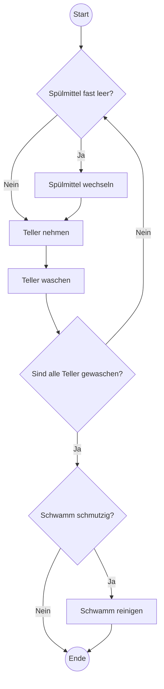
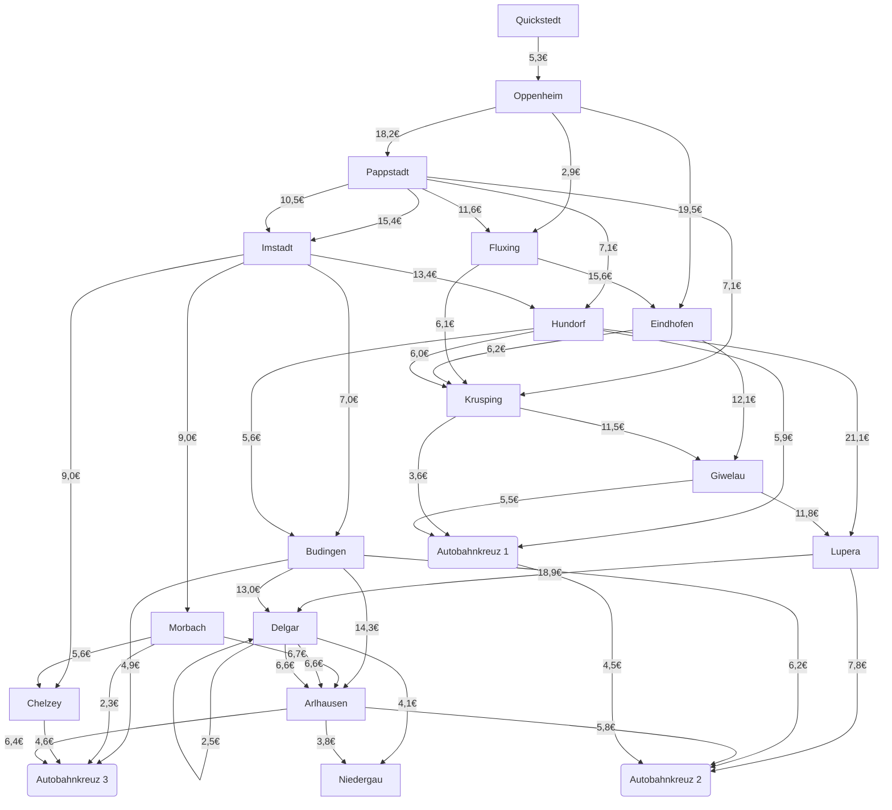
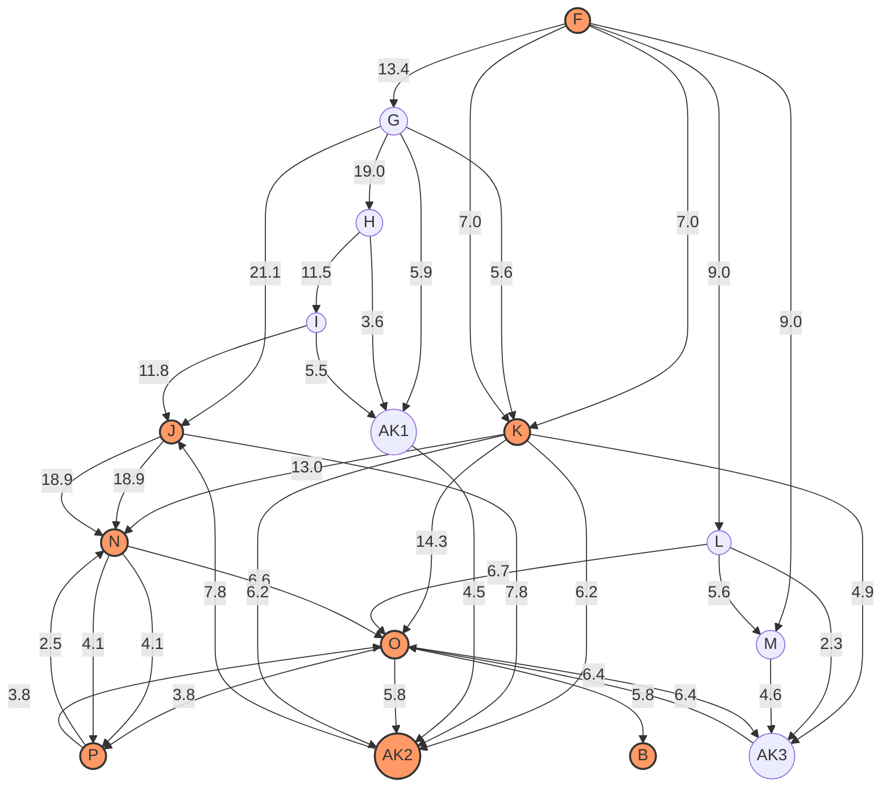
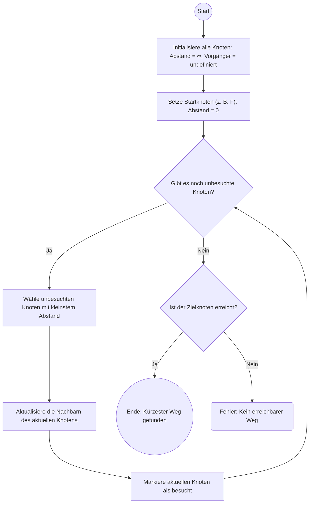
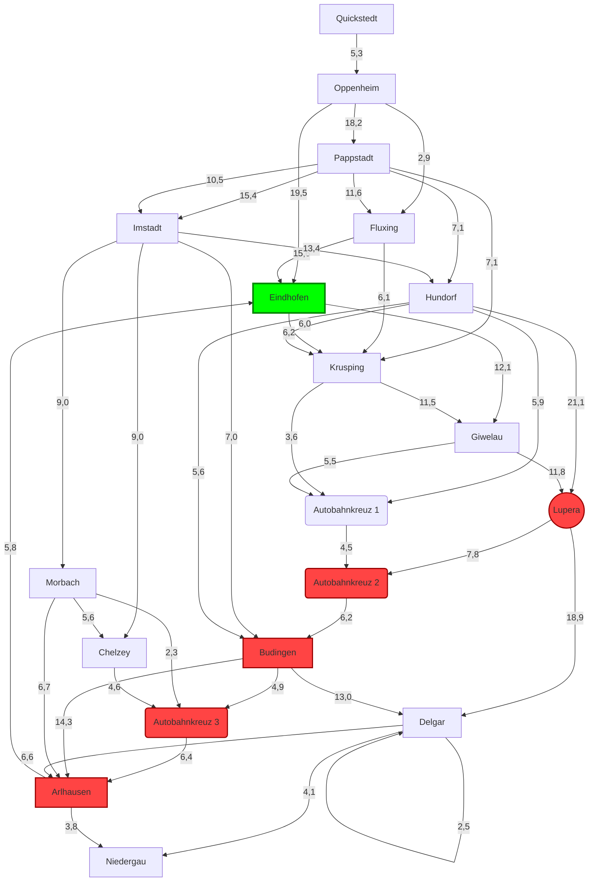

# ePortfolio

- [ePortfolio](#eportfolio)
  - [Plan 0](#plan-0)
    - [1️⃣ **Aufgabe 1: Definiere den Begriff Algorithmus und kläre seine Herkunft**](#1️⃣-aufgabe-1-definiere-den-begriff-algorithmus-und-kläre-seine-herkunft)
    - [2️⃣ **Aufgabe 2: Betrachte das Bild Tellerspülen und stelle den Algorithmus grafisch dar**](#2️⃣-aufgabe-2-betrachte-das-bild-tellerspülen-und-stelle-den-algorithmus-grafisch-dar)
  - [Plan 1](#plan-1)
    - [🌐 Tiefgang 1: Navigation und Algorithmen](#-tiefgang-1-navigation-und-algorithmen)
      - [📌 Aufgabe](#-aufgabe)
      - [🔍 Brute Force](#-brute-force)
        - [📋 Vorgehen:](#-vorgehen)
      - [🧠 Mensch vs 🤖 Computer](#-mensch-vs--computer)
        - [🤖 **Computer**:](#-computer)
        - [🧠 **Mensch**:](#-mensch)
      - [⚠️ Problematik bei 100 Städten](#️-problematik-bei-100-städten)
    - [Tiefgang 2](#tiefgang-2)
      - [1️⃣ Abstrakte Abbildung der U-Bahnlinie](#1️⃣-abstrakte-abbildung-der-u-bahnlinie)
      - [2️⃣ Relevanzbewertung der Karteninformationen](#2️⃣-relevanzbewertung-der-karteninformationen)
      - [3️⃣ Abstrakte Darstellung der Karte](#3️⃣-abstrakte-darstellung-der-karte)
      - [4️⃣ Feinabstimmung durch Gleichformung](#4️⃣-feinabstimmung-durch-gleichformung)
    - [🌍 Tiefgang 3 - Dijkstra und die Ameisen](#-tiefgang-3---dijkstra-und-die-ameisen)
      - [🐜 Wie ermitteln wir den kürzesten Weg von Imstadt nach Oppenheim?](#-wie-ermitteln-wir-den-kürzesten-weg-von-imstadt-nach-oppenheim)
      - [1️⃣ **Frage 1:** Wohin gelangt ihr nach 7 Minuten?](#1️⃣-frage-1-wohin-gelangt-ihr-nach-7-minuten)
      - [2️⃣ **Frage 2:** Wie geht es weiter?](#2️⃣-frage-2-wie-geht-es-weiter)
        - [Kürzeste Strecke von Imstadt nach Oppenheim](#kürzeste-strecke-von-imstadt-nach-oppenheim)
        - [📐 Dijkstra-Algorithmus: Der Weg zur Effizienz](#-dijkstra-algorithmus-der-weg-zur-effizienz)
          - [🚀 Was ist der Dijkstra-Algorithmus?](#-was-ist-der-dijkstra-algorithmus)
          - [🔍 Wie funktioniert der Dijkstra-Algorithmus?](#-wie-funktioniert-der-dijkstra-algorithmus)
          - [📋 Schritte:](#-schritte)
    - [Tiefgang 4 von Lupera (J) nach Eindhofen (E)](#tiefgang-4-von-lupera-j-nach-eindhofen-e)
      - [Grafische Darstellung](#grafische-darstellung)
    - [Tiefgang 5](#tiefgang-5)
  - [Exkurs Graph](#exkurs-graph)
  - [Berechnung der Fahrzeiten](#berechnung-der-fahrzeiten)
    - [Gegebene Geschwindigkeiten:](#gegebene-geschwindigkeiten)
    - [Fahrzeitberechnung](#fahrzeitberechnung)
      - [1. Imstadt nach Budingen (7 km, Landstraße, 80 km/h)](#1-imstadt-nach-budingen-7-km-landstraße-80-kmh)
      - [2. Imstadt nach Chelzey (8,2 km, Gemeindestraße, 50 km/h)](#2-imstadt-nach-chelzey-82-km-gemeindestraße-50-kmh)
      - [3. Imstadt nach Morbach (9,0 km, Landstraße, 80 km/h)](#3-imstadt-nach-morbach-90-km-landstraße-80-kmh)
      - [4. Imstadt nach Hundorf (13,4 km, Gemeindestraße, 50 km/h)](#4-imstadt-nach-hundorf-134-km-gemeindestraße-50-kmh)
      - [5. Imstadt nach Pappstadt (10,5 km, Landstraße, 80 km/h)](#5-imstadt-nach-pappstadt-105-km-landstraße-80-kmh)
    - [Hinweis zu Ortsdurchfahrten:](#hinweis-zu-ortsdurchfahrten)

---

## Plan 0

### 1️⃣ **Aufgabe 1: Definiere den Begriff Algorithmus und kläre seine Herkunft**

📌 **Begriffserklärung:**  
Ein **Algorithmus** ist eine systematische, endliche Folge von Anweisungen, die ein bestimmtes Problem lösen oder eine Aufgabe erfüllen. Er zeichnet sich durch folgende Merkmale aus:
- 🔄 **Endlichkeit**: Der Algorithmus hat ein klares Ende.
- ✔️ **Eindeutigkeit**: Jede Anweisung ist präzise und eindeutig.
- ⚙️ **Ausführbarkeit**: Jede Anweisung muss technisch umsetzbar sein.
- 🔀 **Determinismus**: Der Algorithmus führt immer zum gleichen Ergebnis, wenn die gleichen Eingabedaten vorliegen.

📚 **Herkunft:**  
Der Begriff stammt von dem persischen Mathematiker **al-Chwarizmi** (ca. 780–850 n. Chr.), dessen Werke zur Algebra und Mathematik die Grundlage für systematische Verfahren bildeten.  
Der Name "Algorithmus" leitet sich von der Latinisierung seines Namens **Algoritmi** ab und wurde später auf alle strukturierten Problemlösungsverfahren angewendet.

---

### 2️⃣ **Aufgabe 2: Betrachte das Bild Tellerspülen und stelle den Algorithmus grafisch dar**

📌 **Aufgabe:**  
Stelle den Algorithmus zum Tellerspülen grafisch dar, indem du für Start und Ende ein Oval verwendest, für Anweisungen ein Rechteck und bei Entscheidungen eine Raute.  



## Plan 1

### 🌐 Tiefgang 1: Navigation und Algorithmen  

#### 📌 Aufgabe  

Hier tauchen wir in die Tiefe der Navigation ein. Schritt für Schritt werden wir abstrakter und gelangen zu einem Algorithmus für die **kürzeste Strecke**.  

Das Material stammt aus dem Buch [Abenteuer Informatik](https://abenteuer-informatik.de/), zu dem es auch eine Webseite gibt!  

---

#### 🔍 Brute Force  

**Definition**: Brute Force ist eine Methode, bei der **alle möglichen Kombinationen** durchprobiert werden, um eine optimale Lösung zu finden.  

##### 📋 Vorgehen:  
- Alle möglichen Wege von **Imstadt** nach **Oppenheim** durchspielen.  
- Die Gesamtdistanz jedes Weges berechnen.  
- Den kürzesten Weg ermitteln.  

Alle möglichen Verbindungen:



1. Initialisierung: Der Startpunkt ist Imstadt (F) und das Ziel ist Oppenheim (B).
2. Wegfindung: Alle möglichen Verbindungen von Imstadt (F) werden verfolgt.

- Von `F` gibt es folgende Verbindungen:
    - `F` → `G` (Kosten: 13,4€)
    - `F` → `K` (Kosten: 7,0€)
    - `F` → `L` (Kosten: 9,0€)
    - `F` → `M` (Kosten: 9,0€)
3. Exploration der möglichen Wege: Der Algorithmus überprüft alle Wege, die von den Nachbarstädten ausgehen:
    - **Pfad 1:** `F` → `G` → `H` → `I` → `J` → `N` → `P` → `O` → `P` → `O` → `AK1` → `AK2` → `B`.
        ```mermaid
        flowchart TD
            F[Imstadt]
            G[Hundorf]
            H[Krusping]
            I[Giwelau]
            J[Lupera]
            N[Delgar]
            P[Niedergau]
            O[Arlhausen]
            AK1[Autobahnkreuz 1]
            AK2[Autobahnkreuz 2]
            B[Oppenheim]
            
            F -->|13,4€| G
            G -->|6,0€| H
            H -->|11,5€| I
            I -->|11,8€| J
            J -->|18,9€| N
            N -->|4,1€| P
            P -->|6,6€| O
            O -->|3,8€| P
            P -->|6,6€| O
            O -->|4,5€| AK1
            AK1 -->|4,5€| AK2
            AK2 -->|18,9€| B
        ```
    - **Pfad 2:** `F` → `K` → `O` → `B`.
        ```mermaid
        flowchart TD
            F[Imstadt]
            K[Budingen]
            O[Arlhausen]
            B[Oppenheim]
            
            F -->|7,0€| K
            K -->|14,3€| O
            O -->|5,8€| B
        ```
    - **Pfad 3:** `F` → `M` → `P` → `B`.
        ```mermaid
            flowchart TD
                F[Imstadt]
                K[Budingen]
                O[Arlhausen]
                B[Oppenheim]
                
                F -->|7,0€| K
                K -->|14,3€| O
                O -->|5,8€| B
        ```

4. Berechnung der Kosten für jeden Pfad:
    - **Pfad 1**:
        - Kosten: 13,4+6,0+11,5+11,8+18,9+4,1+6,6+3,8+6,6+4,5+4,5+18,9=111,6€
    - **Pfad 2**:
        - Kosten: 7,0€ + 14,3€ + 5,8€ = 27,1€
    - **Pfad 3**:
        - Kosten: 9,0€ + 4,1€ + 6,6€ + 5,8€ = 25,5€
5. Vergleichen und Finden des günstigsten Weges:

Der günstigste Weg wäre in diesem Fall der **Pfad 3** mit den Kosten von `25,5`€.

---

#### 🧠 Mensch vs 🤖 Computer  

##### 🤖 **Computer**:  
- Kann systematisch und effizient **alle Wege berechnen**.  
- Vorteilhaft bei großen Datenmengen: schneller und weniger fehleranfällig.  

##### 🧠 **Mensch**:  
- Kann sinnvolle **Heuristiken** oder Ausschlusskriterien anwenden (z. B. kürzere Strecken bevorzugen).  
- Versteht den **Kontext** besser und kann priorisieren.  

---

#### ⚠️ Problematik bei 100 Städten  

- Die Anzahl der möglichen Wege **steigt exponentiell** (Kombinatorik).  
- Der **Brute-Force-Ansatz** wird unpraktikabel, da die Berechnungszeit enorm zunimmt.  
- Effiziente Algorithmen wie der **Dijkstra-Algorithmus** sind notwendig.  

---

### Tiefgang 2

#### 1️⃣ Abstrakte Abbildung der U-Bahnlinie

📌 **Aufgabe:**  
Notiere 3–4 Informationen, die in der abstrakten Darstellung weggelassen wurden:  
- 🔄 **Umsteigemöglichkeiten**
  - 🎨 Farbcode  
- 🕒 **Betriebszeiten**  
- 🎟️ **Fahrkarteninformationen**  
- 🚧 **Besondere Hinweise**
  - 🛠️ Baustellen  
  - ➡️ Umleitungen  

---

#### 2️⃣ Relevanzbewertung der Karteninformationen
Erstelle eine Liste mit allen Informationen aus der Karte aus **Tiefgang 1** und bewerte diese nach Relevanz für die Lösung: **Finde die günstigste Strecke!**  

| 🗂️ **Eigenschaft**                   | ✔️ **Wichtig?** | 💡 **Begründung**                                                       |
| ----------------------------------- | -------------- | ---------------------------------------------------------------------- |
| 🏙️ **Namen der Städte**              | ✔️ Ja           | Start und Ziel sind entscheidend.                                      |
| 📍 **Position der Städte**           | ❌ Nein         | Nicht relevant – es geht nur um Kosten, nicht um Zeit oder Entfernung. |
| 🌆 **Größe der Städte**              | ❌ Nein         | Keine Auswirkung auf das Problem.                                      |
| 🛤️ **Verlauf der Straßen**           | ❌ Nein         | Nicht relevant – Zugfahrt steht im Fokus.                              |
| 📏 **Länge der Straßen**             | ❌ Nein         | Kosten sind ausschlaggebend, nicht Zeit oder Entfernung.               |
| 🛣️ **Namen und Nummern der Straßen** | ❌ Nein         | Nicht notwendig für die Kostenermittlung.                              |
| 🚗 **Straßentyp**                    | ❌ Nein         | Keine Relevanz für die Kostenberechnung.                               |
| ↔️ **Straße führt von... nach...**   | ❌ Nein         | Nicht relevant für Kostenanalyse.                                      |
| 🌳 **Landschaftliche Informationen** | ❌ Nein         | Keine Bedeutung für die Aufgabe.                                       |
| 💰 **Kosten zwischen X und Y**       | ✔️ Ja           | Wichtiger Faktor zur Ermittlung der günstigsten Strecke.               |

---

#### 3️⃣ Abstrakte Darstellung der Karte

📌 **Aufgabe:**  
Überführe die Karte in eine vereinfachte Darstellung wie eine **U-Bahn-Karte**:  
- ✂️ Kürze unnötige Details wie Kreuzungen, Abfahrten oder Überführungen.  
- 🎨 Zeichne einen Flowgraphen (siehe Abschnitt [Vorgehen](#vorgehen)).

---

#### 4️⃣ Feinabstimmung durch Gleichformung

📌 **Aufgabe:**  
Bearbeite die Karte mit der Methode der **Gleichformung**:  
- 🔍 Unterscheide zwischen **normalen** und **spezialisierten** Elementen.  
- 🛠️ **Normalisiere spezielle Elemente**, sodass nur nützliche Informationen übrigbleiben.  
- ➡️ Abgleich der Informationen mit der Tabelle oben, um irrelevante Details zu entfernen.  

---
### 🌍 Tiefgang 3 - Dijkstra und die Ameisen

#### 🐜 Wie ermitteln wir den kürzesten Weg von Imstadt nach Oppenheim?

Wir können uns dabei von der Natur inspirieren lassen. Ein Stamm Ameisen auf der Suche nach Futter steht vor einem ähnlichen Problem: Eine Kundschafterin findet ein großes Stück Fleisch. Welchen Weg sollen die Arbeiterinnen nehmen, um das Futter schnell zu erreichen?

Setzen wir also die Ameisen auf den Ausgangspunkt **Imstadt** (Ⓘ). Fünf Wege führen von dort weg, also teilen sich unzählige Ameisen auf, um diese zu erkunden. Angenommen, alle Ameisen sind gleich schnell (1 km pro Minute). Mit dem Finger verfolgen wir den Weg der Ameisen.

---

#### 1️⃣ **Frage 1:** Wohin gelangt ihr nach 7 Minuten?

📌 **Aufgabe:**  
Färbt auf der Karte die Wege der Ameisen ein und betrachtet das Bild nach „7 min“. Was bedeutet das? Speichert ein Bild der Karte als Zwischenstand und formuliert einen Antwortsatz.


---

#### 2️⃣ **Frage 2:** Wie geht es weiter?

Die Ameisen setzen ihren Weg fort und teilen sich bei B so auf, dass jeder mögliche Weg von B aus mit einem neuen Trupp Ameisen beschickt wird. Wenn ein Trupp an einem Ort zuerst ankommt, bedeutet das, dass dieser Weg der schnellste ist.


##### Kürzeste Strecke von Imstadt nach Oppenheim

📌 **Berechnung der Strecke:**  
Die kürzeste Strecke von F(Imstadt) nach B(Oppenheim) beträgt **24,8 Einheiten**, und der Pfad lautet:  
`F → G → H → AK1 → AK2 → B`

---

##### 📐 Dijkstra-Algorithmus: Der Weg zur Effizienz

###### 🚀 Was ist der Dijkstra-Algorithmus?  
Der **Dijkstra-Algorithmus** ist ein Graph-Suchalgorithmus, der den **kürzesten Weg** von einem Startknoten zu allen anderen Knoten in einem Graphen findet.

###### 🔍 Wie funktioniert der Dijkstra-Algorithmus?

###### 📋 Schritte:

1. **Initialisierung:**
   - Setze die Distanz zum Startknoten auf `0`.
   - Alle anderen Knoten erhalten die Distanz `∞` (unendlich).

2. **Besuche den nächsten Knoten:**
   - Wähle den Knoten mit der **geringsten aktuellen Distanz**, der noch nicht besucht wurde.

3. **Aktualisiere Distanzen:**
   - Berechne die Distanz zu allen benachbarten Knoten.
   - Aktualisiere die Distanz, falls sie kürzer ist als der bisher bekannte Wert.

4. **Wiederhole:**
   - Fahre fort, bis alle Knoten besucht wurden oder das Ziel erreicht ist.




**Pseudocode Beispiel**
```
1. function Dijkstra(Graph, source):
2.     dist = {}
3.     prev = {}
4.     Q = priority queue of all nodes in Graph
5.     
6.     for each node v in Graph:
7.         dist[v] = ∞
8.         prev[v] = undefined
9.     dist[source] = 0
     
10.    while Q is not empty:
11.        u = node in Q with smallest dist[u]
12.        remove u from Q

13.        for each neighbor v of u:
14.            alt = dist[u] + weight(u, v)
15.            if alt < dist[v]:
16.                dist[v] = alt
17.                prev[v] = u
18.                update Q with new dist[v]
     
19.    return dist, prev
```

---

### Tiefgang 4 von Lupera (J) nach Eindhofen (E)

1. **Starte in der Stadt J**:
   - Markiere die Stadt **J** **rot** und weise ihr die Kennzahl **0** zu.
   - Bezeichne **J** als **aktuelle Stadt**.

2. **Bearbeite alle Nachbarstädte der aktuellen Stadt**:
   - Gehe zu allen direkt erreichbaren **Nachbarstädten**, die **noch nicht rot markiert** sind.
   - Führe für jede Nachbarstadt die folgenden Schritte aus:
     1. Berechne die **Summe** aus der Kennzahl der aktuellen Stadt (rote Zahl) und der **Streckenlänge** zur Nachbarstadt.
     2. Überprüfe die Nachbarstadt:
        - **Keine Kennzahl vorhanden**: Weise die berechnete Summe als neue Kennzahl zu. Markiere die Strecke zur aktuellen Stadt.
        - **Kennzahl kleiner oder gleich der Summe**: Nichts tun.
        - **Kennzahl größer als die Summe**: Lösche die bisherige Kennzahl und die Markierung zur bisherigen Stadt. Markiere die Strecke zur aktuellen Stadt neu.

3. **Wähle die nächste Stadt**:
   - Betrachte alle Städte, die bereits eine **rote Kennzahl** haben, aber noch nicht **rot markiert** sind.
   - Suche die Stadt mit der **kleinsten Kennzahl**.
     - Falls mehrere Städte die **gleiche kleinste Kennzahl** haben, wähle eine davon **beliebig** aus.

4. **Markiere die nächste Stadt**:
   - Bezeichne die Stadt mit der kleinsten Kennzahl als **aktuelle Stadt**.
   - Markiere die Stadt **rot** und zeichne die zugehörige Strecke komplett **rot** nach.

5. **Überprüfe das Ziel**:
   - Falls die **Zielstadt E** noch **nicht rot markiert** ist, kehre zurück zu **Schritt 2** (While-Loop).

6. **Ende des Algorithmus**:
   - Sobald die Zielstadt **E rot markiert** ist, endet der Algorithmus.
   - Der kürzeste Weg von Stadt **J** nach Stadt **E** wurde erfolgreich gefunden.

---

#### Grafische Darstellung  



### Tiefgang 5

## Exkurs Graph 
```
    o
   /|\
  o-o-o
   \|/
    o
```
**O** steht für die Knoten.

**Kanten** verbinden jeden Knoten mit jedem anderen.

---

**Für 𝑛 = 7:** Die Anzahl möglicher Wege, die bei einem Startpunkt beginnen, ergibt sich aus ( 𝑛 − 1 ) ! = 6 !.  
6 ! = 6 ⋅ 5 ⋅ 4 ⋅ 3 ⋅ 2 ⋅ 1 = 720.  
Um alle möglichen Wege zu erfassen, muss dies 𝑛 − 1 mal durchgeführt werden, da der Startpunkt jedes Mal unterschiedlich gewählt werden kann:  
**Formel:** ( 𝑛 − 1 ) ⋅ ( 𝑛 − 1 ) ! = 6 ⋅ 720 = 4320.

---

**Die Formel lautet🔢** ( 𝑛 − 1 ) ⋅ ( 𝑛 − 1 ) !:  
Für 𝑛 = 10: ( 10 − 1 ) ⋅ ( 10 − 1 ) ! = 9 ⋅ 9 ! = 9 ⋅ 362,880 = 3,265,920.  
Für 𝑛 = 20: ( 20 − 1 ) ⋅ ( 20 − 1 ) ! = 19 ⋅ 19 !.  
Zunächst berechnen wir 19 !:  
19 ! = 19 ⋅ 18 ⋅ 17 ⋅ ⋯ ⋅ 1 = 121,645,100,408,832,000.  
Dann multiplizieren wir mit 19:  
19 ⋅ 19 ! = 2,310,079,200,000,000,000.

---

**Ein Googol ∞** ist eine sehr große Zahl, die als 10^100 definiert ist, also eine 1 gefolgt von 100 Nullen. Sie wurde von Mathematiker Edward Kasner eingeführt, um extrem große Zahlen zu veranschaulichen. Ein Googol ist viel größer als die Anzahl der Atome im sichtbaren Universum. Der Begriff wurde auch als Inspiration für den Namen der Suchmaschine Google verwendet.

---

**Berechnung 📈** für 𝑛 = 7:  
Summe = ( 7 − 1 ) ⋅ 7² = 6 ⋅ 49 = 294.  
Der Dijkstra-Algorithmus benötigt für 𝑛 = 7 also 21 Schritte.

---

**Berechnung 📈** für 𝑛 = 15:  
Summe = ( 15 − 1 ) ⋅ 15² = 14 ⋅ 225 = 3150.  
Der Dijkstra-Algorithmus benötigt für 𝑛 = 15 also 105 Schritte.

---

**Vergleich 🔍** mit der Abbildung „Knoten Möglichkeiten Dijkstra“:  
Die Abbildung sollte für 𝑛 = 7 den Wert 21 und für 𝑛 = 15 den Wert 105 angeben.  
Diese Werte resultieren aus der Summenformel und stellen den reduzierten Aufwand dar, im Vergleich zu der Anzahl an Permutationen beim Brute-Force-Ansatz.

---

**Zusammenfassung📝**  
Für 𝑛 = 7: 21 Schritte.  
Für 𝑛 = 15: 105 Schritte.  
Der Aufwand wächst hierbei linear, im Gegensatz zur exponentiellen Wachstumskurve beim Brute-Force-Ansatz.

---

**Das Travelling Salesman Problem 🌐 (TSP)**  
Das TSP ist ein bekanntes Problem in der Informatik und Mathematik. Dabei geht es darum, dass ein Handelsreisender den kürzesten Weg finden soll, um eine bestimmte Anzahl von Städten genau einmal zu besuchen und am Ende wieder an den Ausgangspunkt zurückzukehren.  
Das Problem wird oft in der Graphentheorie beschrieben, bei der Städte als Knoten und Verbindungen als Kanten dargestellt werden.

---

**Das TSP 🌐** gehört zu den sogenannten NP-schweren Problemen. Das bedeutet, dass es sehr schwer ist, eine optimale Lösung für große Instanzen des Problems zu finden. Für solche Probleme gibt es keine bekannten schnellen Algorithmen, die sie für beliebige Eingaben effizient lösen können. Es wurde gezeigt, dass das TSP mit den NP-vollständigen Problemen verwandt ist, die ebenfalls zu den schwierigsten Problemen in der Informatik zählen. Das macht das TSP besonders herausfordernd und gleichzeitig wichtig für viele Anwendungen wie Logistik, Routenplanung oder Netzwerkdesign.

---

**Die Frage 🕵️‍♂️ P=NP?**  
ist eines der größten ungelösten Probleme der Informatik. Es geht darum, ob Probleme, die sich leicht überprüfen lassen (NP), auch genauso leicht lösbar sind (P). Bis heute hat niemand eine Antwort darauf gefunden.

---

**Falls sich 🤔 herausstellen würde, dass P=NP**, könnten komplexe Probleme wie das Travelling Salesman Problem effizient gelöst werden.  
Der Text macht aber auch deutlich, dass "NP" eigentlich nicht "nicht praktisch lösbar" bedeutet, sondern "nichtdeterministisch polynomial lösbar". In der Praxis bedeutet das, dass reale Computer Schwierigkeiten hätten, diese Probleme schnell zu lösen, selbst wenn P=NP bewiesen würde.

---

**Zusammengefasst📝:**  
Die Frage ist eine der wichtigsten Herausforderungen in der Informatik und könnte viele schwierige Probleme auf einmal klären.


**Berechne📈** nun die Zeit für eine Fahrt von Imstadt nach Budingen


## Berechnung der Fahrzeiten

Wir berechnen die Fahrzeiten für die verschiedenen Streckenabschnitte, wobei wir die Geschwindigkeit und mögliche Ortsdurchfahrten berücksichtigen.

### Gegebene Geschwindigkeiten:
- **Autobahnen**: 130 km/h
- **Landstraße** (gelb, rot): 80 km/h
- **Gemeindestraßen** (weiß): 50 km/h
- **Ortsdurchfahrten**: Zusätzliche 8 Minuten (gilt auch bei Autobahnen, wenn sie einen Ort durchqueren)

### Fahrzeitberechnung

Die **Fahrzeit (in Stunden)** wird berechnet mit der Formel:

$$
\text{Fahrzeit (in Stunden)} = \frac{\text{Streckenlänge (in km)}}{\text{Geschwindigkeit (in km/h)}}
$$

Falls die Strecke durch eine **Ortsdurchfahrt** führt, fügen wir 8 Minuten hinzu.

#### 1. Imstadt nach Budingen (7 km, Landstraße, 80 km/h)

$$
\text{Fahrzeit} = \frac{7 \, \text{km}}{80 \, \text{km/h}} = 0,0875 \, \text{Stunden} = 5,25 \, \text{Minuten}
$$

#### 2. Imstadt nach Chelzey (8,2 km, Gemeindestraße, 50 km/h)

$$
\text{Fahrzeit} = \frac{8,2 \, \text{km}}{50 \, \text{km/h}} = 0,164 \, \text{Stunden} = 9,84 \, \text{Minuten}
$$

#### 3. Imstadt nach Morbach (9,0 km, Landstraße, 80 km/h)

$$
\text{Fahrzeit} = \frac{9,0 \, \text{km}}{80 \, \text{km/h}} = 0,1125 \, \text{Stunden} = 6,75 \, \text{Minuten}
$$

#### 4. Imstadt nach Hundorf (13,4 km, Gemeindestraße, 50 km/h)

$$
\text{Fahrzeit} = \frac{13,4 \, \text{km}}{50 \, \text{km/h}} = 0,268 \, \text{Stunden} = 16,08 \, \text{Minuten}
$$

#### 5. Imstadt nach Pappstadt (10,5 km, Landstraße, 80 km/h)

$$
\text{Fahrzeit} = \frac{10,5 \, \text{km}}{80 \, \text{km/h}} = 0,13125 \, \text{Stunden} = 7,875 \, \text{Minuten}
$$

### Hinweis zu Ortsdurchfahrten:
Falls eine der Strecken eine Ortsdurchfahrt enthält, müssen wir zusätzlich 8 Minuten berücksichtigen. Wir haben diese Information aber noch nicht für jede Strecke.

