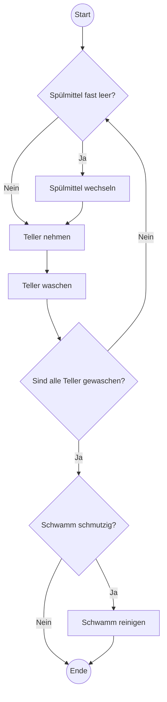
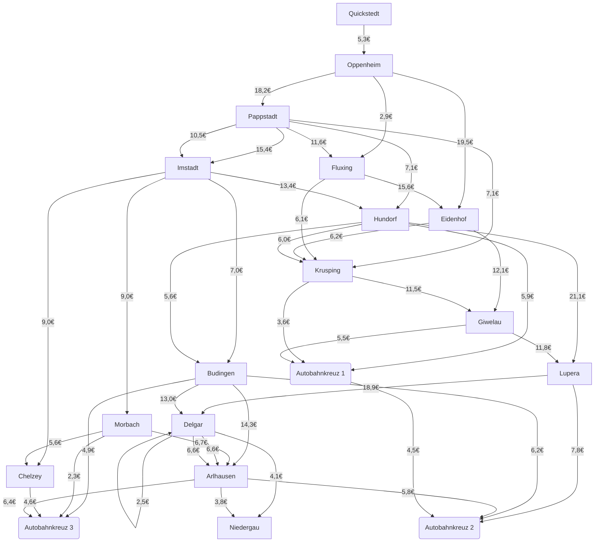

# ePortfolio

- [Plan 1](#plan-1)
    - [Tiefgang 1](#tiefgang-1)
        - [Brute Force](#brute-force)
    - [Tiefgang 2](#tiefgang-2)
    - [Tiefgang 3](#tiefgang-3)
    - [Tiefgang 4](#tiefgang-4)
    - [Tiefgang 5](#tiefgang-5)


-  [Alogrithmen]

## Plan 0
**Aufgabe 1:**

**Definiere den Begriff Algorithmus und kläre seine Herkunft**

Ein Algorithmus ist eine systematische, endliche Folge von Anweisungen, die ein bestimmtes Problem lösen oder eine Aufgabe erfüllen. Er zeichnet sich durch Endlichkeit, Eindeutigkeit, Ausführbarkeit und Determinismus aus. Der Begriff stammt von dem persischen Mathematiker al-Chwarizmi (ca. 780–850 n. Chr.), dessen Werke zur Algebra und Mathematik die Grundlage für systematische Verfahren bildeten. Der Name "Algorithmus" leitet sich von der Latinisierung seines Namens Algoritmi ab und wurde später auf alle strukturierten Problemlösungsverfahren angewendet.


**Aufgabe 2:**
 **Betrachte das Bild Tellerspülen und stelle den Algorithmus grafisch dar. (Benutze für Start und Ende ein Oval, für die Anweisung ein Rechteck und bei Entscheidungen eine Raute)**



## Plan 1

### 🌐 Tiefgang 1: Navigation und Algorithmen  

#### 🚀 Aufgabe  

Hier tauchen wir in die Tiefe der Navigation ein. Schritt für Schritt werden wir abstrakter und gelangen zu einem Algorithmus für die **kürzeste Strecke**.  

Das Material stammt aus dem Buch [Abenteuer Informatik](https://abenteuer-informatik.de/), zu dem es auch eine Webseite gibt!  

---

#### 🔍 Brute Force  

**Definition**: Brute Force ist eine Methode, bei der **alle möglichen Kombinationen** durchprobiert werden, um eine optimale Lösung zu finden.  

##### 📋 Vorgehen:  
- Alle möglichen Wege von **Imstadt** nach **Oppenheim** durchspielen.  
- Die Gesamtdistanz jedes Weges berechnen.  
- Den kürzesten Weg ermitteln.  

Alle möglichen Verbindungen:



1. Initialisierung: Der Startpunkt ist Imstadt (F) und das Ziel ist Oppenheim (B).
2. Wegfindung: Alle möglichen Verbindungen von Imstadt (F) werden verfolgt.

- Von `F` gibt es folgende Verbindungen:
    - `F` → `G` (Kosten: 13,4€)
    - `F` → `K` (Kosten: 7,0€)
    - `F` → `L` (Kosten: 9,0€)
    - `F` → `M` (Kosten: 9,0€)
3. Exploration der möglichen Wege: Der Algorithmus überprüft alle Wege, die von den Nachbarstädten ausgehen:
    - **Pfad 1:** `F` → `G` → `H` → `I` → `J` → `N` → `P` → `O` → `P` → `O` → `AK1` → `AK2` → `B`.
        ```mermaid
        flowchart TD
            F[Imstadt]
            G[Hundorf]
            H[Krusping]
            I[Giwelau]
            J[Lupera]
            N[Delgar]
            P[Niedergau]
            O[Arlhausen]
            AK1[Autobahnkreuz 1]
            AK2[Autobahnkreuz 2]
            B[Oppenheim]
            
            F -->|13,4€| G
            G -->|6,0€| H
            H -->|11,5€| I
            I -->|11,8€| J
            J -->|18,9€| N
            N -->|4,1€| P
            P -->|6,6€| O
            O -->|3,8€| P
            P -->|6,6€| O
            O -->|4,5€| AK1
            AK1 -->|4,5€| AK2
            AK2 -->|18,9€| B
        ```
    - **Pfad 2:** `F` → `K` → `O` → `B`.
        ```mermaid
        flowchart TD
            F[Imstadt]
            K[Budingen]
            O[Arlhausen]
            B[Oppenheim]
            
            F -->|7,0€| K
            K -->|14,3€| O
            O -->|5,8€| B
        ```
    - **Pfad 3:** `F` → `M` → `P` → `B`.
        ```mermaid
            flowchart TD
                F[Imstadt]
                K[Budingen]
                O[Arlhausen]
                B[Oppenheim]
                
                F -->|7,0€| K
                K -->|14,3€| O
                O -->|5,8€| B
        ```

4. Berechnung der Kosten für jeden Pfad:
    - **Pfad 1**:
        - Kosten: 13,4+6,0+11,5+11,8+18,9+4,1+6,6+3,8+6,6+4,5+4,5+18,9=111,6€
    - **Pfad 2**:
        - Kosten: 7,0€ + 14,3€ + 5,8€ = 27,1€
    - **Pfad 3**:
        - Kosten: 9,0€ + 4,1€ + 6,6€ + 5,8€ = 25,5€
5. Vergleichen und Finden des günstigsten Weges:

Der günstigste Weg wäre in diesem Fall der **Pfad 3** mit den Kosten von `25,5`€.

---

#### 🧠 Mensch vs 🤖 Computer  

##### 🤖 **Computer**:  
- Kann systematisch und effizient **alle Wege berechnen**.  
- Vorteilhaft bei großen Datenmengen: schneller und weniger fehleranfällig.  

##### 🧠 **Mensch**:  
- Kann sinnvolle **Heuristiken** oder Ausschlusskriterien anwenden (z. B. kürzere Strecken bevorzugen).  
- Versteht den **Kontext** besser und kann priorisieren.  

---

#### ⚠️ Problematik bei 100 Städten  

- Die Anzahl der möglichen Wege **steigt exponentiell** (Kombinatorik).  
- Der **Brute-Force-Ansatz** wird unpraktikabel, da die Berechnungszeit enorm zunimmt.  
- Effiziente Algorithmen wie der **Dijkstra-Algorithmus** sind notwendig.  

---

#### Tiefgang 2
- Umsteigemöglichkeiten
    - Farbcode
- Betriebszeiten
- Fahrkarteninformationen 
- Besondere Hinweise
    - Baustellen oder auch Umleitungen 


| Eigenschaft                   | Ist Wichtig | Begründung                                                                                        |
| ----------------------------- | ----------- | ------------------------------------------------------------------------------------------------- |
| Namen der Städte              | [x]         | Start und Ziel                                                                                    |
| Position der Städte           | [ ]          | Start und Ziel ist bekannt und da es nur um die Kosten geht und nicht um die zeit oder entfernung |
| Größe der Städte              | [ ]         |                                                                                                   |
| Verlauf der Straßen           | [ ]         | Zug fahrt                                                                                         |
| Länge der Straßen             | [ ]         | Da es nur um die Kosten geht und nicht um die zeit oder entfernung und es eine Zug reise ist      |
| Namen und Nummern der Straßen | [ ]         | Da es nur um die Kosten geht und nicht um die zeit oder entfernung und es eine Zug reise ist      |
| Straßentyp                    | [ ]         | Da es nur um die Kosten geht und nicht um die zeit oder entfernung und es eine Zug reise ist      |
| Straße führt von... nach...   | [ ]         | Da es nur um die Kosten geht und nicht um die zeit oder entfernung und es eine Zug reise ist      |
| Landschaftliche Information   | [ ]         | Da es nur um die Kosten geht und nicht um die zeit oder entfernung und es eine Zug reise ist      |
| Kosten zwischzen X und Y      | [x]         | Wir wollen die günstigste strecke finden                                                           |


#### Tiefgang 3
#### Tiefgang 4
#### Tiefgang 5


## 🧭 Dijkstra-Algorithmus: Der Weg zur Effizienz  

### 🚀 Was ist der Dijkstra-Algorithmus?  

Der **Dijkstra-Algorithmus** ist ein Graph-Suchalgorithmus, der den **kürzesten Weg** von einem Startknoten zu allen anderen Knoten in einem Graphen findet.  

---

### 🔍 Wie funktioniert der Dijkstra-Algorithmus?  

#### 📋 Schritte:  
1. **Initialisierung**:  
   - Setze die Distanz zum Startknoten auf `0`.  
   - Alle anderen Knoten erhalten die Distanz `∞` (unendlich).  

2. **Besuche den nächsten Knoten**:  
   - Wähle den Knoten mit der **geringsten aktuellen Distanz**, der noch nicht besucht wurde.  

3. **Aktualisiere Distanzen**:  
   - Berechne die Distanz zu allen benachbarten Knoten.  
   - Aktualisiere die Distanz, falls sie kürzer ist als der bisher bekannte Wert.  

4. **Wiederhole**:  
   - Fahre fort, bis alle Knoten besucht wurden oder das Ziel erreicht ist.  

---

### 🧠 Vorteile des Dijkstra-Algorithmus  

- **Effizienz**: Funktioniert schnell bei Graphen mit nicht-negativen Gewichtungen.  
- **Flexibilität**: Kann verwendet werden, um kürzeste Wege zu einem einzigen Ziel oder von einem einzigen Startpunkt zu allen anderen Knoten zu finden.  
- **Realwelt-Anwendungen**: Navigation, Netzwerk-Routing, Planung von Lieferwegen.  
